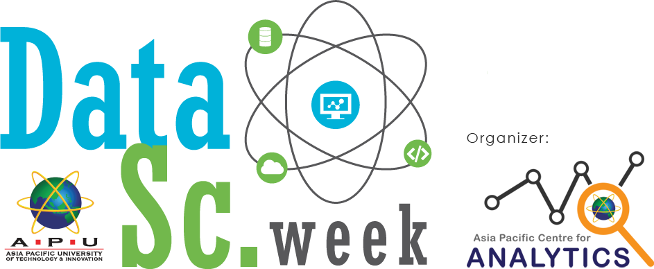
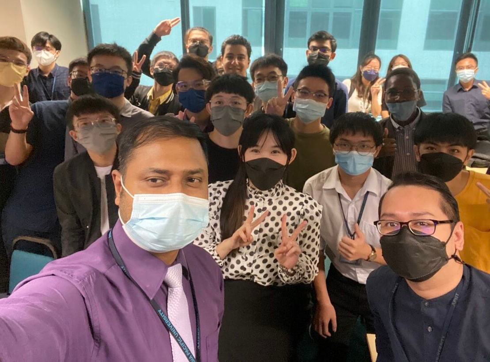

<body>

    

    <h1 id="getInTouch" align="center" style="font-family: 'Segoe UI', Tahoma, Geneva, Verdana, sans-serif;" >Get in Touch with me</h1>
      
    
    
    
    
    

<!--
        
    -->

     
    <h1 align="center" style="font-family: 'Segoe UI', Tahoma, Geneva, Verdana, sans-serif;" >Skills</h1>
    <a>
        
        
        
        
        
        
        
        
        
        
        
        
        
        
        
        
        
        
        
        
        
        
        
        
        
        
        
        
        
        
        
        
    </a>
    <h1 align="center" style="font-family: 'Segoe UI', Tahoma, Geneva, Verdana, sans-serif;" >Learning</h1>
    <a>
        
        
        
        
        
        
        
        
        
        
        
        
        
    </a>

      
    
      
    

        
<b>About Me</b>

    

        ### Hi there 👋
        Hola! I'm currently studying in <a href="https://new.apu.edu.my">Asia Pacific University of Technology & Innovation of Malaysia</a>.I keep exploring in IT world which changes drastically every second, learning through online resources, workshops, analytics club, and Google Student Developer club activities. I like to work with people. With everyones creativity, imagination, and contribution, we are able to come up with something interesting and demanded by the market. I always challenge myself and break my limits to come up with outstanding ideas. Along this way, I found that data-driven enables us to make brilliant decisions. Hence, I choose data analysis as my major. Life is a huge party, I will continue exploring my life in the crowd and improving myself.   
        If you are interested in hiring me😆😆, Please reach me at <a href="#getInTouch">LinkedIn</a>!
           
        <h3 style="background-color:lightgray;padding:20px;"><b>Activities</b></h3>
        

            
APU Data Science Week 2022

              
            <a href="https://www.linkedin.com/feed/update/urn:li:activity:7002121539588427776?utm_source=share&utm_medium=member_desktop">
            <b style="background-color:light-gray;">Hybrid Cloud - Modern Data Analytics Solution</b>  
            
            
            </a>
        
  
        <h1 style="font-family:'Gill Sans', 'Gill Sans MT', Calibri, 'Trebuchet MS', sans-serif;background-color:lightgray;padding:40px">「 EXPLORE, CHALLENGE and be a better self. 」</h1>
    

    

</body>